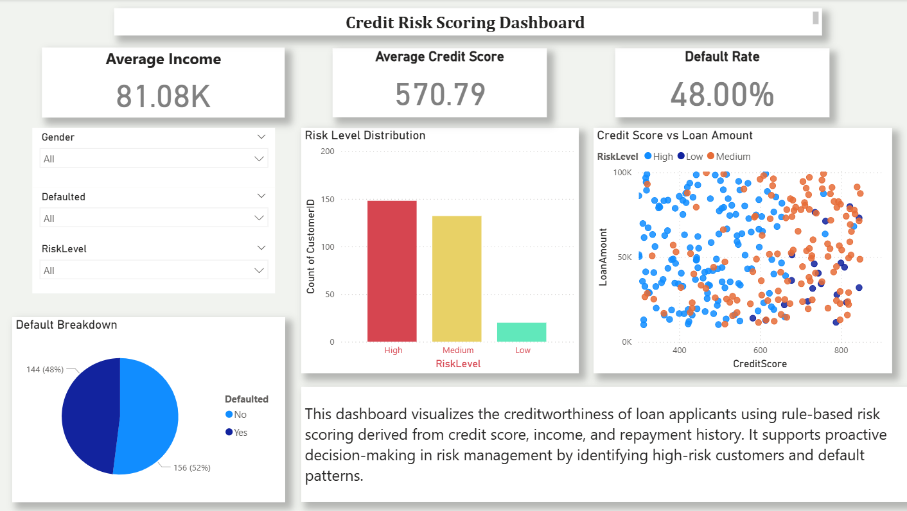

# 💳 Credit Risk Scoring Dashboard

This project is a data-driven dashboard built using **Python (Google Colab)** and **Power BI**, designed to analyze the creditworthiness of loan applicants using historical financial behavior and rule-based risk scoring.

## 🧰 Tools Used
- Google Colab (Python/Pandas for data cleaning, LTV & risk scoring)
- Microsoft Excel (optional)
- Power BI Desktop (interactive dashboard creation)
- GitHub (project hosting)

## 📊 Dashboard Features
- 💰 **KPI Cards**: Avg Income, Avg Credit Score, Default Rate
- 📉 **Bar Chart**: Customers by Risk Level (High, Medium, Low)
- 🥧 **Pie Chart**: Defaulted vs Non-Defaulted
- 🔵 **Scatter Plot**: Credit Score vs Loan Amount
- 🎛 **Slicers**: Gender, Risk Level, Defaulted

## 🔍 Insights
- High-risk customers show low credit scores and frequent late payments
- Most defaults come from Medium to High risk groups
- Targeting these groups with preventive measures can reduce loss

## 📁 Files Included
- `analysis.ipynb`: Python code for data cleaning and feature engineering
- `cleaned_customer_data.csv`: Cleaned dataset used in Power BI
- `dashboard.png`: Final dashboard screenshot

## 📸 Preview

## 🚀 How to Use:
1. Open `analysis.ipynb` in Jupyter or Google Colab to clean and score data
2. Open Power BI → Load `cleaned_customer_data.csv`
3. Recreate visuals using the guide in this repo

👉 [Click here to view the step-by-step Power BI guide](dashboard_guide.md)

